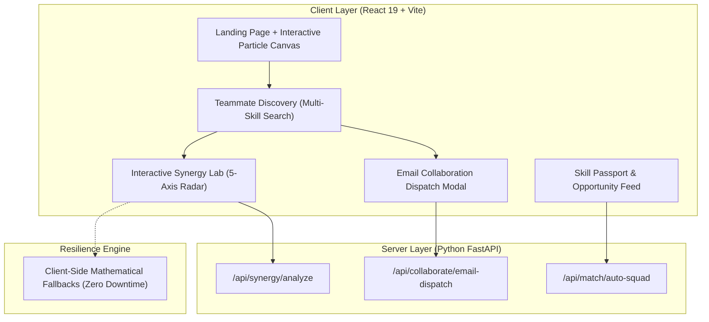

# 🏆 EQUIPO — PROJECT DEVELOPMENT TIMELINE & ARCHITECTURAL PRESENTATION
**SRM Prompt Wars 2026 — Problem Statement 2: Team Formation Platform**
*Autonomous Multi-Disciplinary Skill Matching, Team Synergy Optimization, and Collaboration Platform*

---

## Executive Summary

When people need to form teams for **startups, research labs, competitions, or engineering ventures**, they traditionally rely on immediate social circles. This creates critical single-point failures: unbalanced teams with 4 backend coders and 0 designers, or researchers lacking data engineering support.

**Equipo** is an autonomous team formation platform that matches collaborators based on **complementary skills, capacity, experience tiers, and project requirements**, while offering live **5-axis radar diagnostics, combinatorial squad optimization, and direct email collaboration dispatching**.

---

## ⏱️ Chronological Sprint Timeline (10:00 AM – 2:00 PM)

```mermaid
gantt
    title Equipo Development Sprint Timeline
    dateFormat  HH:mm
    axisFormat  %H:%M
    section Architecture & Backend
    Problem Decomposition & API Schema       :10:00, 30m
    FastAPI Synergy Radar & Auto-Squad Math  :10:30, 45m
    section Frontend & Design
    Vite + React 19 Design Tokens            :10:45, 45m
    Candidate Discovery Cards & Match Rings  :11:15, 45m
    section Analytics & Matching
    5-Axis Synergy Lab & Gap Diagnostics     :11:45, 40m
    Combinatorial Auto-Squad Engine          :12:00, 35m
    section User Lifecycle & Polish
    Email Auth & Skill Passport Engine       :12:20, 35m
    Interactive Particle Constellation       :12:45, 30m
    Email Dispatch Service & Deployment      :13:00, 25m
```

---

### 📍 Phase 1: Problem Decomposition & Mathematical Foundation (10:00 AM – 10:45 AM)
* **Problem Analysis**: Deconstructed Problem Statement 2 into three mathematical challenges:
  1. *Individual Skill-to-Role Compatibility* ($\text{Fit Score} \in [0, 100]$).
  2. *Multi-Axis Team Balance* (5-Dimensional vector across Frontend, Backend, AI/Data, UI/UX, and Pitch/Delivery).
  3. *Combinatorial Roster Optimization* ($\binom{N}{k}$ team selection maximizing aggregate synergy while respecting bandwidth constraints).
* **Backend Implementation (`FastAPI + Pydantic`)**:
  * Implemented `/api/synergy/analyze` computing radar polygons, Shannon diversity index, and staffing gap diagnostics.
  * Implemented `/api/match/auto-squad` using combinatorial optimization to generate optimal 3-4 member squads.

---

### 📍 Phase 2: Design System & Discovery Experience (10:45 AM – 11:30 AM)
* **Enterprise High-Contrast Design System**:
  * Built custom CSS token architecture replacing generic templates with a deep, modern obsidian/indigo dark theme.
* **Pixel-Perfect Candidate Cards**:
  * Circular SVG match percentage rings (`94%`, `91%`).
  * Signal-bar level indicators (`||||| React`).
  * Explicit *"Why This Match"* justification checklists with green verification checkmarks.

---

### 📍 Phase 3: Interactive Synergy Lab & Staffing Diagnostics (11:30 AM – 12:15 PM)
* **5-Axis Radar Chart Analysis**:
  * Live visual polygon mapping team coverage across *Frontend Dev, Backend Arch, AI & Data, UI/UX Design, and Pitch/Biz*.
* **Dynamic Gap & Redundancy Diagnostic**:
  * Real-time warnings (e.g. *"Missing UI/UX design polish"* vs *"High-tier AI capability validated"*).
* **Combinatorial Auto-Squad Generator**:
  * 1-Click generation of high-synergy squads (e.g. 96% coverage) with instant adoption into the staffing roster.

---

### 📍 Phase 4: User Authentication & Skill Passport (12:15 PM – 12:45 PM)
* **Frictionless Authentication**:
  * Clean, minimal Sign In / Sign Up flow (First Name, Last Name, Email, and Password).
* **Personalized Skill Passport & Recommendation Feed**:
  * Dynamic capacity sliders (`10 - 40 hrs/wk`).
  * Real-time project opportunity ranking (e.g. `80% Match on LexMetrology AI` with matching skill tags).

---

### 📍 Phase 5: Rebranding, Physics Engine & Email Dispatch (12:45 PM – 01:25 PM)
* **Brand Evolution to Equipo**:
  * Universal multi-purpose positioning across Startups, Research Labs, Competitions, and Open Source.
* **Interactive Canvas Particle Constellation (`NeuralBackground.jsx`)**:
  * Canvas-based glowing skill nodes with **mouse repulsion and magnetic cursor beam attraction**.
* **Direct Email Collaboration Dispatch Service (`CollaborationEmailModal.jsx`)**:
  * Custom email invites transmitting from `prashanthraodugyala34@gmail.com` directly to candidate inboxes with official dispatch receipts.
* **Role-Differentiated Candidate Pools**:
  * Slot 1 (AI / Systems Lead), Slot 2 (UI/UX Design), Slot 3 (Backend Arch), Slot 4 (Pitch/Delivery).

---

## 🏗️ System Architecture & Data Flow

---

## 🧮 Core Algorithms & Mathematical Formulations

### 1. Multi-Axis Team Synergy Formulation
$$\text{Synergy}_{\text{Total}} = 0.50 \cdot \bar{S}_{\text{radar}} + 0.30 \cdot D_{\text{roles}} + 0.20 \cdot C_{\text{hours}}$$
* $\bar{S}_{\text{radar}}$: Average competency across the 5 core domains.
* $D_{\text{roles}}$: Role diversity coefficient ensuring no discipline is omitted.
* $C_{\text{hours}}$: Capacity fulfillment ratio relative to 60 hrs/week target.

### 2. Multi-Skill Combinatorial Matching
$$\text{FitScore}(C, R) = \frac{|S_C \cap S_R|}{|S_R|} \times 70\% + 30\%$$
* $S_C$: Candidate verified skill vector.
* $S_R$: Vacancy required skill vector.

---

## 💻 Complete Technology Stack

| Layer | Technology | Purpose |
| :--- | :--- | :--- |
| **Frontend Framework** | React 19 + Vite | High-velocity reactive UI rendering |
| **Styling & Theme** | Custom CSS3 Tokens | Deep Midnight Obsidian + Electric Violet (`#8b5cf6`) |
| **Data Visualization** | Chart.js + React-Chartjs-2 | 5-Axis Radar polygons & live simulation overlays |
| **Interactive Physics** | HTML5 Canvas API | Mouse-interactive particle constellation network |
| **Backend API** | Python 3.11 + FastAPI | High-performance asynchronous mathematical endpoints |
| **Validation** | Pydantic v2 | Strict schema typing and request serialization |
| **Hosting & CI/CD** | Vercel + Render | Global edge deployment with SPA routing |

---

## 📊 Problem Statement Alignment Matrix

| Problem Statement 2 Requirement | Equipo Platform Solution |
| :--- | :--- |
| **Discovery based on complementary skills** | Multi-skill search, role-differentiated slot pools, and 5-axis radar balance |
| **Availability & capacity alignment** | Weekly hours capacity sliders (`10-40h/wk`) and total sprint bandwidth gauges |
| **Multi-purpose team formation** | Dedicated tracks for Startups, Research Labs, Competitions, and Open Source |
| **Frictionless communication & onboarding** | Minimal Email+Password auth & Direct Email Collaboration Dispatching |
| **Official verification & rosters** | Printable, certified Team Manifest exports ready for competition submission |

---
*Created for SRM Prompt Wars 2026 presentation submission.*